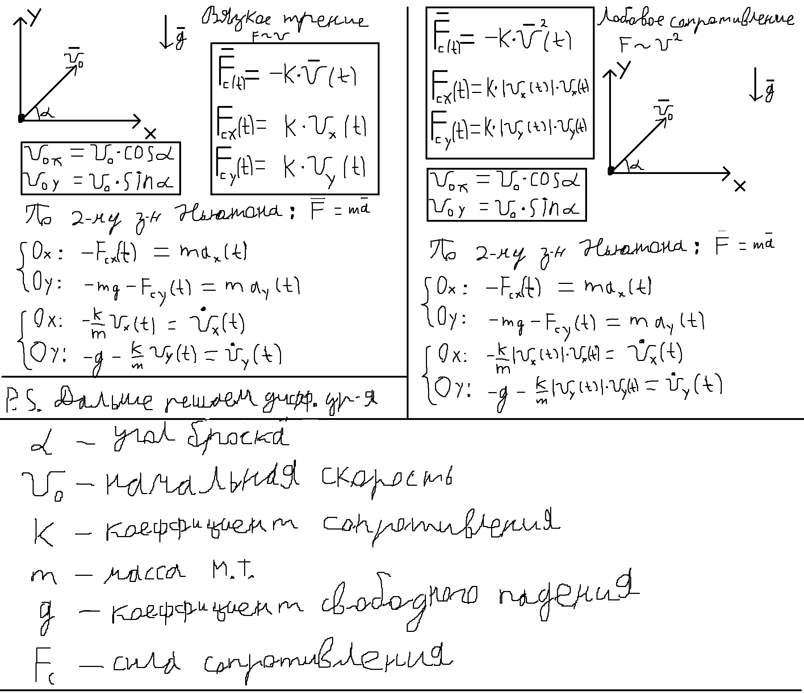
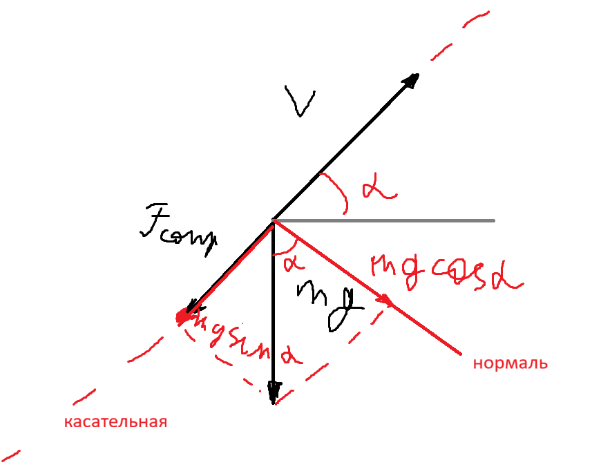
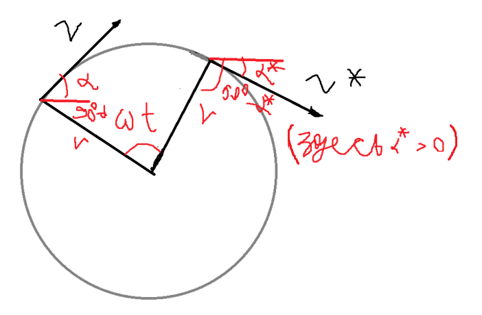

# M1 Полёт камня
## Физическая модель

## Аналитическое решение для $ k = 0 $ (отсутсвие трения)
$$ \begin{cases}
\dot{v}_x = 0 \\
\dot{v}_y = -g \\
\end{cases} $$
$$ \implies v_x = \mathrm{const} \implies v_x = v_0 \cos{\alpha} $$
$$ x = \int_0^t{v_x dt} + x_0 = x_0 + v_x t = x_0 + v_0 \cos{\alpha} t $$
$$ \implies t = \frac{x - x_0}{v_0 \cos{\alpha}} $$
$$ v_y = \int_0^t{-g dt} + C = C - g t \implies v_y = v_0 \sin{\alpha} - g t $$
$$ y = \int_0^t{v_y dt} + y_0 = y_0 + v_0 \sin{\alpha} t - \frac{g t^2}{2}$$
$$ \text{(подставим $t$ найденное выше)} $$

## Подсчёт с помощью дуг

$$ a_n = g \cos{\alpha}$$
$$ a_\tau = - g \sin{\alpha} - F_{сопр} $$
$$ \text{Здесь $ F_{сопр} = kv $ или $ F_{сопр} = kv^2 $ в зависимости от условия.}$$

$$ r = \frac{v^2}{a_n} $$
$$ \text{(обозначу радиус кривизны $r$ т. к. мне так почему-то привычнее)}$$
$$ \omega = -\frac{v}{r} $$
$$ \text{(минус т. к. должна быть направлена против часовой стрелки)}$$

$$\alpha^* = \alpha + \omega \Delta t$$

$$ \begin{cases}
x^* = x + r \cos{90^\circ - \alpha} - r \cos{90^\circ - \alpha^*} = x + r \sin{\alpha} - r \sin{\alpha} \\
y^* = y - r \sin{90^\circ - \alpha} + r \sin{90^\circ - \alpha^*} = x - r \cos{\alpha} + r \cos{\alpha} \\
\end{cases} $$

$$ \dot{x} = \frac{x^* - x}{\Delta t} + o(1) \text{ при } \Delta t \to 0 $$
$$ \dot{y} = \frac{y^* - y}{\Delta t} + o(1) \text{ при } \Delta t \to 0 $$