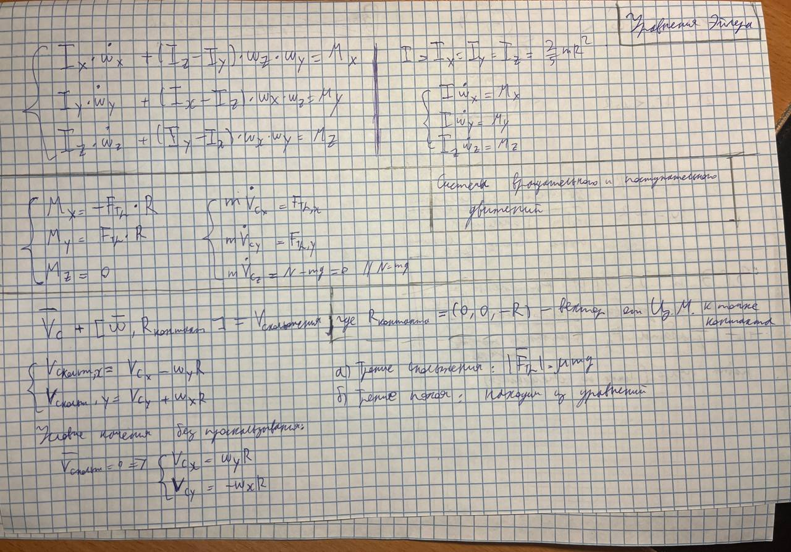

# M3 - 3D случай

## В состоянии покоя

$$ \begin{cases}
\frac {F_x} m = \dot v_x = \dot \omega_y R = \frac {M_x} {I_x} R \\
\frac {F_y} m = \dot v_y = -\dot \omega_x R = \frac {M_y} {I_y} R \\
\end{cases} $$

$$ \begin{cases} 
\frac {F_{g, x} - F_{тр,x}} m = \frac {F_{тр,x} R^2} {I_x} \\
\frac {F_{g, y} - F_{тр,y}} m = \frac {F_{тр,y} R^2} {I_y} \\
\end{cases} $$

$$ \begin{cases} 
F_{g, x} = (\frac {mR^2} {I_x} + 1) F_{тр,x}  \\
F_{g, y} = (\frac {mR^2} {I_y} + 1) F_{тр,y}  \\
\end{cases} $$

$$ \begin{cases} 
F_{тр,x} = \frac {F_{g, x}} {\frac {mR^2} {I_x} + 1}  \\
F_{тр,y} = \frac {F_{g, y}} {\frac {mR^2} {I_y} + 1}  \\
\end{cases} $$